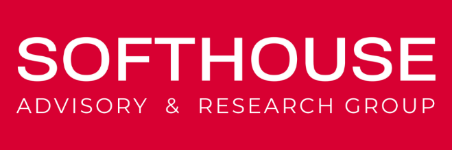
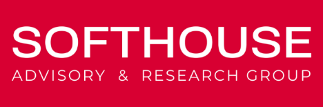

**SOFTHOUSE AI ADVISORY**

**AI Enablement** **and Implementation Proposal**

**For Myland**

Oct 23, 2024

ID: EXA_ClientName_YYYYMMDD-\#.\#

This document contains proprietary and confidential material of Softhouse Advisory Services Ltd., its subsidiaries and its authorized partners. Any unauthorized reproduction, use, or disclosure of this material, or any part thereof, is strictly prohibited. This document is solely for the use of Softhouse employees and authorized partners and customers. The material furnished in this document is meant to be accurate and reliable. However, the material herein is provided “as is” and Softhouse shall not be liable for the use of this document, or any material included herein by any third party. Softhouse reserves the right to make changes to this document or any material included herein at any time and without notice. - Confidential

Chris,

I hope you're doing well.

I'm excited to share our proposal for the AI Integration and Data Consolidation Strategy for MyLand. After the AI workshop I did with MyLand last year, I've been really looking forward to continuing the journey and building on what we started.

This proposal is all about using AI to enhance data integration, insights, and operational efficiency across MyLand. I genuinely believe this is an incredible opportunity to make a big impact on productivity and efficiency across the company.

The plan includes mapping out data sources, identifying key use cases, and implementing AI solutions that can boost productivity and help MyLand lead the way in regenerative agriculture. We want to ensure you get both immediate and long-term value, and the retainer model will help us provide continuous support as MyLand becomes more and more experienced in AI adoption and innovation.

I'm really looking forward to chatting more about this and aligning it with your vision for the future of MyLand.

Best,

Rob

### **Engagement Overview**

In response to MyLand's current challenges and growth, this proposal outlines a comprehensive plan to leverage AI to enhance MyLand’s data integration, insights, and operational efficiency. The engagement will involve mapping existing data sources, evaluating high-impact use cases, and implementing AI-driven solutions to maximize business value, boost productivity, and strengthen MyLand's competitive edge in the regenerative agriculture market.

### **Objectives**

**Data Mapping and Understanding:** Map out and understand the existing systems, including NetSuite, HubSpot, Shepherd, other relevant tools and datasets, to create a comprehensive overview of MyLand's data landscape. This objective focuses on understanding current tools, identifying integration points, and evaluating connectivity. The goal is to provide clarity on how data flows between systems, enabling streamlined access and laying the foundation for future AI-driven initiatives.

-   **Outcome:** A comprehensive mapping of the data and tools across the organization that can be used for any future integrations or AI opportunities, identifying weak spots and any work that needs to be done to better structure data for AI consumption.

    **Identifying Opportunities to Leverage Data:** Identify ways to capitalize on the data integration insights gained. This involves evaluating opportunities to generate actionable insights, enhance reporting capabilities, support customer retention, and assess overall business health. The objective is to leverage the mapped data to identify synergies and high-value opportunities that can drive profitability and strategic growth.

-   **Outcome:** A ranked list of core business opportunities, including estimated effort and an approach for each.

    **Use Case Discovery, Prioritization, and Implementation:** Prioritize AI use cases based on the understanding and opportunities identified, focusing on those that can have the greatest business impact the fastest. Continually implement selected high-value use cases, ensuring resources are allocated effectively to drive key business outcomes, including operational efficiency, revenue growth, and enhanced service quality.

-   **Outcome:** A high velocity pipeline of delivered initiatives that address prioritized use cases, providing tangible business value and clear ROI.

### **Proposed Approach**

The engagement will be structured in three key phases:

**Phase 1: Data Mapping and Understanding (2 –3 weeks duration)**

**Objective**: Identify all current data systems, understand their connectivity, and outline data sources.

**Activities**:

-   Conduct interviews with relevant stakeholders to identify data points, systems, and desired outcomes.

-   Create an audit of relevant tools and assess ease of integration and automation.

-   Create a high-level map of data flows and existing integrations.

-   Evaluate the complexity of connecting each system.

-   Suggest challenges, required changes,

    **Note**: One of the most common causes of failure in AI initiatives is building solutions before there is a clear understanding of the availability and quality of data that AI requires to be effective. Doing this upfront gives us that clear view, and can greatly enhance the return on investment by avoiding dead ends later.

    **Key Outcome**: A comprehensive mapping of data and tools to serve as a foundation for future initiatives.

    **Approach Options for Phases 2 and 3:** The phases can be carried out across the whole company in sequence, where Phase 2 (Use Case Discovery and Prioritization) is completed for all areas before moving to Phase 3 (Implementation of Use Cases). Alternatively, Phases 2 and 3 could be executed consecutively for specific focus areas. This approach allows for prioritizing high-value areas first, enabling quicker identification and implementation of impactful solutions. The choice between these approaches will depend on MyLand's strategic priorities and resource availability.

    **Phase 2: Use Case Discovery and Prioritization (4-5 weeks duration)**

    **Objective**: Educate the team and identify and prioritize use cases for AI applications that can bring the most value to MyLand.

    **Activities**:

-   Conduct an initial education session with the team to help them understand the state of AI and the art of the possible.

-   Facilitate brainstorming sessions to understand specific needs, opportunities, and priorities.

-   Assess the AI models that could be used, the approach from an AI perspective, and the tools that would be leveraged for each use case.

-   Develop a list of possible use cases, including operational efficiency, customer engagement, predictive modeling, and customer communication enhancement.

-   Conduct a skills audit to understand who within MyLand could support implementation efforts if needed.

-   Prioritize use cases based on feasibility, potential ROI, and alignment with MyLand’s strategic goals.

    **Key Outcome**: A ranked list of core business opportunities, including estimated effort and an approach for each.

    **Transition to Retainer-Based Model:** At this point, we transition to a retainer, replacing the traditional engagement model. Phases 1 and 2, which involve assessment, identification, categorization, with limited team interaction, can be time-boxed and adjusted as needed. Phases 3 onwards involve integrating AI solutions into business processes and tools, requiring change management, customer impact, budget considerations, and ongoing adjustments. A retainer model better suits these needs, allowing continuous work until successful implementation.

    **Beyond implementation, the retainer model offers significant value. It can be used to position MyLand as having a Chief AI Officer, enhancing industry reputation and providing PR benefits. It allows flexibility to develop an AI strategy, including governance, ethics, documentation, policies, and an AI usage framework.**

    **Phase 3: Implementation of Use Cases (Retainer-Based Model)**

    **Objective**: Build prototypes and implement solutions for prioritized use cases.

    **Activities**:

-   Design solutions for high-priority use cases, focusing on practical implementation.

-   Develop a mini-ROI analysis for each selected use case continually proving value.

-   Create a high-level implementation plan, including required tools, resources, and timeline.

-   We will build the solution / implement the tool / change the workflow

-   Test with relevant stakeholders and iterate based on feedback.

-   Pilot and implement

-   Train the team as required, assist with change management and process documentation.

    **Key Outcome:** AI implementations delivering tangible business value. The goal is to generate an annual impact on profitability of \$100,000 each month through a variety of methods, such as increasing win rates, gaining broader market reach, aiding customer retention, or lowering operational costs.

    **Note**: Even a relatively simple tool or small iterative improvement in process that saves just one hour per week for each of MyLand’s 50+ employees can translate into significant cost savings as the company scales. These efficiencies contribute to the overall business impact, allowing the company to maximize the value of its workforce while focusing on strategic growth.

    **Transition of AI Enablement and Implementation to MyLand:** As we build out new solutions, the skills and familiarization of the MyLand team with AI should grow. This growth will be an integral part of the retainer model, with the aim of making the AI function sustainable within MyLand.

    An objective of phase 3 will be to transition away from the implementation retainer model once MyLand establishes a fully autonomous and capable AI practice. At that stage, MyLand may opt to adopt a Softhouse AI Advisor support model with a low-Fee subscription fee to retain the strategic guidance and expertise of the Virtual Chief AI Officer.

    However, the timeline for this transition will depend on the level of resources MyLand dedicates to developing skills and supporting AI tooling. There is no rush, and the pace of becoming self-sufficient is entirely up to MyLand.

### **Deliverables**

-   **Data Integration Map**: A detailed overview of data systems and integration possibilities highlighting opportunities and risks.

-   **Use Case Portfolio**: A list of prioritized use cases with feasibility and ROI estimates along with high level estimations of effort and ROI.

-   **Implementation Plans**: Detailed implementation analysis and plan for each chosen use case.

-   **Prototypes for Selected Use Cases**: Working prototypes of prioritized solutions, such as the report generation system to enable assessment and value estimation.

-   **Fully implemented tools and products**: Launched internal and external products and processes across all teams

-   **AI Strategy and Governance Documentation**: A comprehensive AI strategy including AI governance, ethics, documentation policies, and an AI usage framework across the organization.

-   **Enhanced PR Opportunities**: Positioning MyLand as a leader in AI innovation through the association with a Chief AI Officer, enhancing industry reputation and providing visibility.

### **Team**

MyLand will be supported by the SoftHouse Advisory AI team headed up by Rob Williams, Chief AI Officer and comprising of several individuals in various roles.

The team is also supported by the broader SoftHouse Group with a 300 strong technical team comprising of developers, architects, testers and more, all able to assist if required.

-   Rob Williams – Chief AI Officer, Account Manager, Primary point of contact

-   Business Analyst, Facilitator, Trainer

-   AI Implementation Specialist

-   In Product AI Development Subject Matter Expert

-   AI Tooling Specialist

### **Schedule and Fees**

**Initial Duration**: Initial phases (Phase 1 and Phase 2) estimated at 6 weeks duration for the team. This includes additional activities such as skills auditing, model assessment, and AI Education sessions to ensure a thorough foundation for future implementation.

**Initial Fees**: \$60,000 USD Plus Tax for initial 2 phases.

**Retainer-Based Model for Development and Implementation**: Engagement will transition to a retainer model after initial phases, allowing for ongoing integration, change management, and the build-out of sustainable AI capabilities. The retainer model will support the continuous development and implementation of AI solutions, AI governance, ethics, documentation policies, and an AI usage framework. This approach will also enable MyLand to gain enhanced public relations visibility by having a Chief AI Officer on staff, positioning MyLand as a leader in AI innovation. Fees and schedule for the retainer will be dependent on the scope of identified use cases and implementation needs.

**Estimated Retainer Fee Implementation phase**: \$25,000 USD Plus Tax per month (min 3 months)

**Retainer-Based Model for Support**: At the point of which Myland have a sustainable AI practice, the retainable could shift to purely advisory and support with a focus on new AI developments and potential new business opportunities or efficiencies within the organization

**Retainer Fee Support phase**: \$5,000 USD Plus Tax per month

**CONTRACT TERMS**

**THIS AGREEMENT** (the “**Agreement**”)is made and entered into as of the \____________________\_ (the “**Effective Date**”) by and between **Softhouse Advisory Systems INC.**, having its principal place of business at 2 Robert Speck Parkway Suite 750, Mississauga, Ontario, Canada, L4Z 1H8 and \_______________________\_ a company having its principal place of business at \________________________________\_ (“**Client**”).

**WHEREAS** SOFTHOUSE ADVISORY SYSTEMS INC. provides services in the areas of systems development, managed services, consulting, and support, (collectively, “**Consulting Services**”).

**AND WHEREAS** Client desires, on the terms and conditions set forth herein, to contract with SOFTHOUSE ADVISORY SYSTEMS INC., for the provision of Consulting Services.

**NOW THEREFORE** in consideration of the mutual promises, covenants and warranties set forth herein, the parties hereby agree as follows:

1.  **Consulting Services**

Consulting Services to be provided by SOFTHOUSE ADVISORY SYSTEMS INC., to Client will be described in a proposal as a statement(s) of work (“**SOW**”). Client and SOFTHOUSE ADVISORY SYSTEMS INC., will sign a separate SOW for each project assignment.

1.  **Client Responsibilities**

    SOFTHOUSE ADVISORY SYSTEMS INC., will appoint an account manager to work with Client’s respective lead on the project. Client will provide SOFTHOUSE ADVISORY SYSTEMS INC., with access to and use of all information, documentation, computer time and facilities reasonably necessary for SOFTHOUSE ADVISORY SYSTEMS INC., to provide the Consulting Services to Client hereunder.

1.  **Change Request Forms**

    Changes to the Consulting Services described in the SOW will be effective only if agreed to by SOFTHOUSE ADVISORY SYSTEMS INC., and Client in a written document setting forth the modification and, as applicable, any resultant changes to the delivery schedule, fees and payment terms.

1.  **Deliverables**

Client acknowledges and agrees that, subject to the license grants contained in an applicable SOW, SOFTHOUSE ADVISORY SYSTEMS INC., owns know-how, or techniques which may be developed by SOFTHOUSE ADVISORY SYSTEMS INC., as a result of providing Consulting Services.

1.  **Payment Terms**

Client will pay SOFTHOUSE within 15 days of invoice

1.  **Travel**

    Client will reimburse Softhouse Advisory Systems Inc., for reasonable travel and living expenses which will not exceed governmental per diems, found at [www.gsa.gov](http://www.gsa.gov), as incurred by Softhouse Advisory Systems Inc. for travel approved by Client.

2.  **Warranty and Limitation of Liability**

    SOFTHOUSE ADVISORY SYSTEMS INC., warrants only that the Consulting Services provided hereunder will be performed in a workmanlike manner with professional diligence and skill. APART FROM THE FOREGOING WARRANTY, SOFTHOUSE ADVISORY SYSTEMS INC., DISCLAIMS ALL WARRANTIES AND CONDITIONS, WHETHER EXPRESS OR IMPLIED, INCLUDING THE IMPLIED WARRANTIES OF MERCHANTABILITY, EFFORTS, RESULTS, NON-INFRINGEMENT AND FITNESS FOR A PARTICULAR PURPOSE. SOFTHOUSE ADVISORY SYSTEMS INC., MAKES NO WARRANTY AS TO THE RESULTS THAT CLIENT WILL ACHIEVE USING THE CONSULTING SERVICES OR DELIVERABLES PROVIDED BY SOFTHOUSE ADVISORY SYSTEMS INC., OUTSIDE OF ANY WARRANTY IN THIS AGREEMENT.

    SOFTHOUSE ADVISORY SYSTEMS INC’s entire liability for any claims, damages, or loss arising from the provision of professional services to the Client shall be limited to the cost for the particular SOW of said professional service fees within the prior 12 months before the event giving rise to the damages occurs, and no officer, director, agent, or employee of SOFTHOUSE ADVISORY SYSTEMS INC., shall be personally liable for any damages whatsoever. No action may be brought by Client more than two years after the cause of action arose.

**SOFTHOUSE ADVISORY SYSTEMS INC., SHALL NOT BE LIABLE FOR ANY SPECIAL, INDIRECT, INCIDENTAL OR CONSEQUENTIAL DAMAGES ARISING FROM OR RELATED TO THE USE OF THE SOFTWARE OR THE INSTALLATION OR USE OF THIRD PARTY PROGRAMS OR SOFTWARE OR** **IN ANY OTHER WAY ARISING OUT OF THIS AGREEMENT, INCLUDING WITHOUT LIMITATION LOSS OF DATA (DUE TO A “VIRUS” OR OTHERWISE), LOSS OF REVENUE OR PROFITS, FAILURE TO REALIZE SAVINGS OR OTHER BENEFITS, AND CLAIMS AGAINST CUSTOMER BY A THIRD PARTY, EVEN IF ADVISED OF THE POSSIBILITY THEREOF.**

Further, SOFTHOUSE ADVISORY SYSTEMS INC., shall not be liable for any:

1.  damages caused in whole or in part by Client's negligence, wilful misconduct or failure to fulfill its obligations and responsibilities as set forth herein, or

2.  (ii)damages for any delay or failure by SOFTHOUSE ADVISORY SYSTEMS INC., to perform its obligations under this Agreement due to acts of God or any other cause beyond its reasonable control including without limitation, acts of civil or military authority, war, riot, labor dispute, communication line failures or power failures, or

3.  damages arising out of the termination of this Agreement.

Client shall indemnify and hold SOFTHOUSE ADVISORY SYSTEMS INC., harmless from any loss, cost, expense or damage arising out of any claim or proceeding against SOFTHOUSE ADVISORY SYSTEMS INC., by any third party in respect of which Client uses the third party programs, deliverables or software which is based on its performance or non-performance.

The limitations of liability forth in this section shall apply regardless of whether the underlying cause of action is a breach of contract, tort (including negligence) or otherwise and shall survive any termination of this Agreement.

Client is solely responsible to ensure that all programs and data files are adequately duplicated and documented unless agreed to explicitly in writing otherwise. SOFTHOUSE ADVISORY SYSTEMS INC. will not be responsible for Client's failure to do so, nor for the cost of reconstructing programs or lost data.

1.  **Confidentiality**

    In the performance and/or receipt of Consulting Services hereunder, each party may have access to information that is confidential or proprietary to the other party (“**Confidential Information**”). Confidential Information means any information, technical data, or know-how, including, but not limited to, that which relates to research, product plans, products, services, customers, markets, software, developments, inventions, processes, methodologies, designs, engineering, hardware configuration information, marketing or finances of the disclosing party. In order for information to be protected as Confidential Information in accordance with this Agreement, it must be: (a) if embodied in tangible material, clearly identified as Confidential Information by being marked as “Proprietary,” “Confidential,” or with some other appropriate legend; or (b) where such Confidential Information is first conveyed orally or visually, it shall be identified as such as the time of disclosure or the circumstances of such disclosure shall reasonably indicate that such information is proprietary. Confidential Information also includes all source code of the disclosing party, whether or not specifically identified as confidential or proprietary. As between the parties, All Deliverables, and any summaries of Deliverables or materials derived from or based upon Deliverables, are Confidential Information of SOFTHOUSE ADVISORY SYSTEMS INC., except that Confidential Information of Client provided to SOFTHOUSE ADVISORY SYSTEMS INC., remains Client’s Confidential Information even if incorporated into a Deliverable.   
      
    Confidential Information does not include information, technical data or know-how which (a) is in the possession of the receiving party at the time of disclosure as shown by the receiving party’s files and records immediately prior to the time of disclosure; (b) prior to or after the time of disclosure becomes part of the public knowledge or literature other than as a result of any improper inaction or action of the receiving party; (c) is approved by the disclosing party, in writing, for release; (d) is required to be disclosed by applicable law or proper legal, governmental or other competent authority (provided that the party whose information is to be disclosed shall be notified sufficiently in advance of such requirement so that it may seek a protective order (or equivalent) with respect to such disclosure, with which the other party shall fully comply; or (e) is independently developed by the receiving party as shown by the receiving party’s files and records.

    During the term of this Agreement, each party agrees to take all commercially reasonable steps necessary to ensure that the Confidential Information disclosed to it is not disclosed or distributed by its employees or agents in violation of the provisions of this Agreement. The parties further agree not to make each other’s Confidential Information available in any form to any third party, or to use each other’s Confidential Information for any purpose other than those contemplated hereunder.

2.  **Term and Termination**

This Agreement is effective as of the date listed below within the signature line and shall continue in effect until terminated by either party upon sixty (60) days prior written notice; provided, however, that in the event of such notice, this Agreement shall remain in effect in respect of any then current SOW until such time as all work has been completed thereunder. Any such termination shall not relieve either party of their respective obligations under any SOW in effect at the date of termination of the Agreement (which obligations shall remain in effect for such SOW), except as otherwise mutually agreed in writing by the parties.

Client may terminate the SOW attached hereto for convenience upon sixty (60) days prior written notice to SOFTHOUSE ADVISORY SYSTEMS INC. Either party may terminate a specific SOW for cause if the other party fails to perform any of its material obligations under this Agreement and fails to cure the breach within thirty (30) days after receiving written notice thereof from the non-defaulting party.

Upon termination of this Agreement or any SOW attached hereto, Client will pay SOFTHOUSE ADVISORY SYSTEMS INC., for all costs incurred to date of termination at SOFTHOUSE ADVISORY SYSTEMS INC., standard services rates, and SOFTHOUSE ADVISORY SYSTEMS INC. will provide Client with any work in progress up until the date of termination. Except for Deliverables that are licensed under Section 4, within fifteen (15) days after termination of this Agreement, each party shall certify in writing to the other party that all Confidential Information of the other party in conjunction with this Agreement has been destroyed or returned.

1.  **Notices**

All notices relating to this Agreement shall be in writing and shall be delivered (a) by overnight courier or hand; (b) postage prepaid registered first-class mail with return receipt requested; (c) by scanned copy of a written document, sent by email transmission; or (d) facsimile transmission. Notices shall be sent to the address of the other party set forth on the signature page of this Agreement to the attention of a duly-authorized representative of the receiving party or to such other address as either party may specify in accordance with this Section, and shall be deemed given upon personal delivery, five (5) days after deposit in the mail, or upon acknowledgement or receipt of electronic transmission.

1.  **Assignment**

Neither this Agreement, nor any of the rights granted or duties undertaken, may be assigned by either Party without the prior written consent of the other, which consent shall not be unreasonably withheld; provided, however, that consent shall not be required in connection with any assignment to any entity with whom the assigning party merges or consolidates or to which the assigning party sells substantially all of its assets in the business relating to this Agreement.

1.  **Restrictions**

During the term of the Agreement and for a period of two (2) years after termination of the Agreement Client will not recruit, hire, subcontract, employ or use the services of any employee, agent, associates, corporation, contractor, or subcontractor of SOFTHOUSE ADVISORY SYSTEMS INC., that was directly or indirectly providing services to Client during the duration of the Agreement, and should Client breach this term, then Client agrees to pay SOFTHOUSE ADVISORY SYSTEMS INC., twenty-five thousand dollars (\$25,000.00) as a finder’s fee for connecting Client with said employee, agent, associates, corporation, contractor, or subcontractor, and if the former employee, agent, associate, corporation, contractor, or subcontractor of SOFTHOUSE ADVISORY SYSTEMS INC., was providing services to Client for greater than one year while acting for SOFTHOUSE ADVISORY SYSTEMS INC., then for every year greater than one year the Client shall also pay \$10,000 dollars.

Example: Client breaches term and hires an employee of SOFTHOUSE ADVISORY SYSTEMS INC. Client shall pay \$25,000.00 finder’s fee to SOFTHOUSE ADVISORY SYSTEMS INC. The employee while working for SOFTHOUSE ADVISORY SYSTEMS INC., supplied Client with help for three years, therefore Client shall pay SOFTHOUSE ADVISORY SYSTEMS INC., a further \$20,000.00. In total, in this case, Client shall pay SOFTHOUSE ADVISORY SYSTEMS INC. \$45,000.00.

1.  **Governing Law**

Any claim, dispute or controversy arising out of or relating to this Agreement will be governed by and construed in accordance with the laws of the Province of Ontario, without giving effect to any choice of law principles that would require the application of the laws of a different jurisdiction.   
  
Any claim under or relating to this Agreement must be commenced in the City of Toronto, Province of Ontario, and each party consents to venue and jurisdiction in such courts.

1.  **Entire Agreement**

    This Agreement, including any addenda, exhibits or statements of work attached hereto, constitutes the final and entire agreement between the parties concerning SOFTHOUSE ADVISORY SYSTEMS INC., provision of Consulting Services to Client. No purchase order, other ordering document or any hand-written or typewritten text which purports to modify or supplement the printed text of this Agreement shall add to or vary the terms of this Agreement unless signed or initialed by both parties. This Agreement replaces and supersedes any prior verbal understandings, written communications or representations with respect to the subject matter hereof.

1.  **Governing Language**

The parties hereto confirm that they have requested that this Agreement and all related documents be drafted in English.

# 

# **[SIGNATURE PAGE FOLLOWS]**

Accepted and Agreed to:

**IN WITNESS WHEREOF** the parties have executed this Agreement.

|                 | **SOFTHOUSE ADVISORY SYSTEMS INC.** | **CLIENT:** |
|-----------------|-------------------------------------|-------------|
| **PRINT NAME:** |                                     |             |
| **TITLE:**      |                                     |             |
| **DATE:**       |                                     |             |
| **SIGNATURE:**  |                                     |             |

### 
